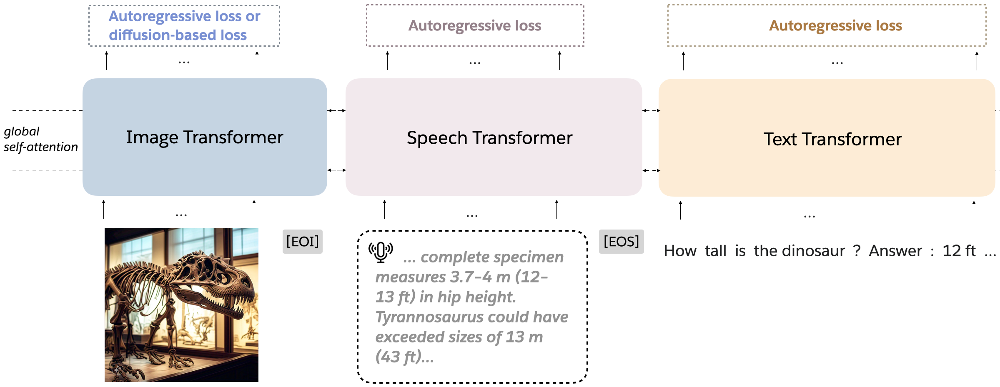

# Mixture-of-Transformers (MoT)



> **Mixture-of-Transformers: A Sparse and Scalable Architecture for Multi-Modal Foundation Models**\
> Weixin Liang, Lili Yu, Liang Luo, Srinivasan Iyer, Ning Dong, Chunting Zhou, Gargi Ghosh, Mike Lewis, Wen-tau Yih, Luke Zettlemoyer, Xi Victoria Lin\
> Paper: https://arxiv.org/abs/2411.04996


## About
How can we reduce pretraining costs for multi-modal models without sacrificing quality?

In our new work, we study this question: [arXiv:2411.04996](https://arxiv.org/abs/2411.04996).

At [@AIatMeta](https://twitter.com/AIatMeta), we introduce **Mixture-of-Transformers (MoT)**, a sparse architecture with **modality-aware sparsity** for every non-embedding transformer parameter (e.g., feed-forward networks, attention matrices, and layer normalization). MoT achieves dense-level performance with **up to 66% fewer FLOPs**!

### Key Results

- ✅ **Chameleon setting (text + image generation):**
  Our 7B MoT matches dense baseline quality using just **55.8% of the FLOPs**.

- ✅ **Speech as a third modality:**
  MoT achieves dense-level speech quality with only **37.2% of the FLOPs**.

- ✅ **Transfusion setting (text autoregressive + image diffusion):**
  MoT matches dense model quality using **one-third of the FLOPs**.

- ✅ **System profiling:**
  MoT achieves:
  - Dense-level image quality in **47%** of the wall-clock time.
  - Dense-level text quality in **75.6%** of the wall-clock time.
  **(Measured on AWS `p4de.24xlarge` instances with NVIDIA A100 GPUs.)**

### Takeaway

**Modality-aware sparsity in MoT offers a scalable path to efficient, multi-modal AI with reduced pretraining costs.**


## Tutorial: Step-by-step implementation of MoT

Enter the **Mixture-of-Transformers (MoT)**—a novel architecture that decouples every non-embedding parameter by modality, including feed-forward networks, attention, and normalization layers.

Let's dive in!

---

### **Prerequisite: Your Own Transformer Model**

To implement MoT, start with a basic transformer model structure. Here’s a simplified example:

```python
class FeedForward(torch.nn.Module):
    ...

class Attention(torch.nn.Module):
    ...

class TransformerBlock(torch.nn.Module):
    def __init__(self, args):
        super().__init__()
        self.attention = Attention(args)
        self.feed_forward = FeedForward(args)

    def forward(self, x, *args):
        x = x + self.attention(x, *args)
        return x + self.feed_forward(x, *args)

class Transformer(torch.nn.Module):
    def __init__(self, args):
        super().__init__()
        self.layers = nn.ModuleList([TransformerBlock(args) for _ in range(args.n_layers)])

    def forward(self, x, *args):
        for layer in self.layers:
            x = layer(x, *args)
        return x

```

---

### **Step 1: Modality-Specific Feed-Forward Networks**

The **ModalityUntiedFeedForward** class enhances the feed-forward network by creating separate experts for each modality, enabling specialized processing for tasks involving multiple modalities, such as text, image, or speech.

#### **Key Features**
1. **Separate Experts**: Each modality has its own feed-forward expert, instantiated using the existing `FeedForward` class for modularity and simplicity.
2. **Dynamic Routing**: Tokens are dynamically routed to the appropriate expert using a `modality_mask`.
3. **Normalization Per Modality**: Each modality expert applies its own normalization layer to ensure tailored processing.

#### **Code**

```python
class ModalityUntiedFeedForward(torch.nn.Module):
    def __init__(self, args):
        super().__init__()
        self.n_modalities = args.n_modalities  # Number of modalities, e.g., 2 (text, image) or 3 (text, image, speech)

        # Initialize feed-forward experts for each modality
        self.local_experts = torch.nn.ModuleList([
            FeedForward(
                dim=args.dim,
                hidden_dim=int(args.ffn_exp * args.dim),
                dropout=args.ffn_dropout,
                ...
            ) for _ in range(self.n_modalities)
        ])

        # Initialize modality-specific normalization layers
        self.local_experts_ffn_norm = torch.nn.ModuleList([
            build_norm_fn(args.norm_type, args.dim, args.norm_eps, args.norm_affine)
            for _ in range(self.n_modalities)
        ])

    def forward(self, x, modality_masks):
        expert_outputs = []

        # Process tokens for each modality separately
        for i in range(self.n_modalities):
            expert_input = x[modality_masks[i]]  # Select tokens for this modality
            expert_output = self.local_experts[i](expert_input)  # Feed-forward processing
            expert_output = self.local_experts_ffn_norm[i](expert_output)  # Normalization
            expert_outputs.append(expert_output)

        # Merge modality-specific outputs into a unified tensor
        merged_output = torch.empty_like(x)
        for i in range(self.n_modalities):
            merged_output[modality_masks[i]] = expert_outputs[i]

        return merged_output
```

#### **Example of `modality_mask`**
If `modality_src_tokens` indicates the modality of each token, e.g., `[0, 1, 0, 2]` (text, image, text, speech):
- `modality_mask` identifies which tokens belong to each modality:
  ```
  [[True, False, True, False],  # Text
   [False, True, False, False], # Image
   [False, False, False, True]] # Speech
  ```
This mask routes tokens to the appropriate modality-specific expert.


---

### **Step 2: Modality-Specific Attention Class**

The **ModalityUntiedAttention** class extends the standard transformer attention mechanism by introducing modality-specific parameters for queries (`wq`), keys (`wk`), values (`wv`), and output projections (`wo`). It also incorporates modality-specific normalization layers to ensure that the model can handle modality-specific representations more effectively.

---

### **Key Features**
1. **Decoupled Parameters**: Separate parameters (`wq`, `wk`, `wv`, `wo`) for each modality to capture modality-specific relationships.
2. **Modality-Specific Normalization**: Norm layers for each modality applied to intermediate results (`q`, `k`, `v`) and final attention outputs.
3. **Dynamic Token Routing**: Tokens are dynamically routed to modality-specific experts using `modality_masks`.
4. **Efficient Processing**: Sequential processing and merging ensure efficient and flexible computation.

---

### **Implementation**

```python
class ModalityUntiedAttention(torch.nn.Module):
    """
    Modality-specific attention with decoupled query, key, value, and output projections,
    along with modality-specific normalization layers.
    """

    def __init__(
        self,
        args: ModelArgs,
        dim: int,
        head_dim: int,
        n_heads: int,
        n_kv_heads: int,
        dropout: float,
        use_rope: bool,
        init_args: InitArgs,
        init_depth: Optional[int],
        norm_type: str,
        norm_eps: float = 1e-5,
        qk_normalization: bool = False,
    ):
        super().__init__()

        self.n_modalities = args.n_modalities

        # Initialize modality-specific query, key, value, and output projections
        self.local_experts_wq = self._create_experts(dim, n_heads * head_dim, init_args)
        self.local_experts_wk = self._create_experts(dim, n_kv_heads * head_dim, init_args)
        self.local_experts_wv = self._create_experts(dim, n_kv_heads * head_dim, init_args)
        self.local_experts_wo = self._create_experts(n_heads * head_dim, dim, init_args, row_parallel=True)

        # QK normalization (if enabled)
        if qk_normalization:
            self.local_experts_q_normalization = self._create_norms(head_dim, self.n_modalities)
            self.local_experts_k_normalization = self._create_norms(head_dim, self.n_modalities)

        # Final output normalization for each modality
        self.local_experts_attention_norm = self._create_norms(dim, self.n_modalities, norm_type, norm_eps)

        # Inner attention mechanism
        self.inner_attention = _InnerAttention(
            head_dim=head_dim,
            n_heads=n_heads,
            n_kv_heads=n_kv_heads,
            dropout=dropout,
            use_rope=use_rope,
        )

    def _create_experts(self, input_dim, output_dim, init_args, row_parallel=False):
        """
        Helper to create modality-specific linear projections.
        """
        cls = RowParallelLinear if row_parallel else ColumnParallelLinear
        init_fn = get_init_fn(init_args, input_dim)
        return torch.nn.ModuleList([
            cls(
                input_dim,
                output_dim,
                bias=False,
                init_method=init_fn,
                params_dtype=torch.get_default_dtype(),
            ) for _ in range(self.n_modalities)
        ])

    def _create_norms(self, dim, n_modalities, norm_type=None, eps=1e-5):
        """
        Helper to create modality-specific normalization layers.
        """
        return torch.nn.ModuleList([
            build_norm_fn(
                norm_type,
                dim,
                eps,
                affine=True,
            ) for _ in range(n_modalities)
        ])

    def forward(
        self,
        x: torch.Tensor,
        mask: Optional[torch.Tensor],
        modality_masks: torch.Tensor,
        freqs_cis: Optional[torch.Tensor],
        cache: Optional[Tuple[torch.Tensor, torch.Tensor]] = None,
    ):
        # Extract modality-specific tokens
        expert_outputs_xq, expert_outputs_xk, expert_outputs_xv = self._process_qkv(x, modality_masks)

        # Merge and reshape for attention computation
        xq, xk, xv = self._merge_qkv(expert_outputs_xq, expert_outputs_xk, expert_outputs_xv, x.size(0), modality_masks)

        # Compute attention output
        output, new_cache = self.inner_attention(xq, xk, xv, mask, freqs_cis, cache)

        # Process final output with modality-specific projections and normalization
        output = self._process_final_output(output, modality_masks)

        return output, new_cache

    def _process_qkv(self, x, modality_masks):
        """
        Process query, key, and value projections for each modality.
        """
        expert_outputs_xq, expert_outputs_xk, expert_outputs_xv = [], [], []
        for i in range(self.n_modalities):
            expert_input = x[modality_masks[i]]
            xq = self.local_experts_wq[i](expert_input)
            xk = self.local_experts_wk[i](expert_input)
            xv = self.local_experts_wv[i](expert_input)

            # Apply QK normalization if enabled
            if hasattr(self, "local_experts_q_normalization"):
                xq = self.local_experts_q_normalization[i](xq)
                xk = self.local_experts_k_normalization[i](xk)

            expert_outputs_xq.append(xq)
            expert_outputs_xk.append(xk)
            expert_outputs_xv.append(xv)

        return expert_outputs_xq, expert_outputs_xk, expert_outputs_xv

    def _merge_qkv(self, expert_outputs_xq, expert_outputs_xk, expert_outputs_xv, batch_size, modality_masks):
        """
        Merge modality-specific Q, K, V outputs into unified tensors.
        """
        xq_merged = self._merge_modalities(batch_size, expert_outputs_xq, modality_masks)
        xk_merged = self._merge_modalities(batch_size, expert_outputs_xk, modality_masks)
        xv_merged = self._merge_modalities(batch_size, expert_outputs_xv, modality_masks)
        return xq_merged, xk_merged, xv_merged

    def _merge_modalities(self, batch_size, expert_outputs, modality_masks):
        """
        Merge modality-specific outputs into a unified tensor.
        """
        merged = torch.empty((batch_size, expert_outputs[0].size(1)), device=expert_outputs[0].device)
        for i, expert_output in enumerate(expert_outputs):
            merged[modality_masks[i]] = expert_output
        return merged

    def _process_final_output(self, output, modality_masks):
        """
        Process final attention output with modality-specific `wo` projections and normalization.
        """
        expert_outputs = []
        for i in range(self.n_modalities):
            expert_input = output[modality_masks[i]]
            expert_output = self.local_experts_wo[i](expert_input)
            expert_output = self.local_experts_attention_norm[i](expert_output)
            expert_outputs.append(expert_output)
        return self._merge_modalities(output.size(0), expert_outputs, modality_masks)
```

---

### **How It Works**
1. **Initialization**:
   - Modality-specific projections (`wq`, `wk`, `wv`, `wo`) and norm layers are created for each modality.
2. **Token Routing**:
   - Tokens are routed to the correct experts using `modality_masks`.
3. **Attention Computation**:
   - Modality-specific queries, keys, and values are processed and merged for the inner attention mechanism.
4. **Output Projection and Normalization**:
   - Attention outputs are projected back and normalized per modality.


---

## **Step 3: Handling Norms**

**Good news**—if your `TransformerBlock` already handles normalization within the attention and feed-forward classes, you're all set:

```python
class TransformerBlock(torch.nn.Module):
    def forward(self, x):
        h = x + self.attention(x)
        out = h + self.feed_forward(h)
        return out
```

If not, move normalization into the respective attention and feed-forward classes, as shown in the implementations above.

---

## **Bringing It All Together**

By combining **ModalityUntiedFeedForward** and **ModalityUntiedAttention**, MoT introduces modality-specific specialization while preserving the transformer’s elegance. These modular extensions integrate seamlessly into existing transformer architectures, offering efficient and scalable solutions for multi-modal tasks.

---

## **Why MoT?**

- **Specialization**: Separate parameters for each modality enhance task-specific performance.
- **Efficiency**: Reduces redundant computation, especially for diverse multi-modal datasets.
- **Flexibility**: Supports any number of modalities, from text and images to speech and beyond.

---

Excited to try it out? With MoT, you’re not just building models—you’re pushing the boundaries of multi-modal AI! 🚀


## Citation

If you use this codebase, or otherwise find our work valuable, please cite Mixture-of-Transformers (MoT):
```
@article{mixture-of-transformers2024,
  title={Mixture-of-Transformers: A Sparse and Scalable Architecture for Multi-Modal Foundation Models},
  author={Liang, Weixin and Yu, Lili and Luo, Liang and Iyer, Srinivasan and Dong, Ning and Zhou, Chunting and Ghosh, Gargi and Lewis, Mike and Yih, Wen-tau and Zettlemoyer, Luke and Lin, Xi Victoria},
  journal={arXiv preprint arXiv:2411.04996},
  year={2024}
}
```
