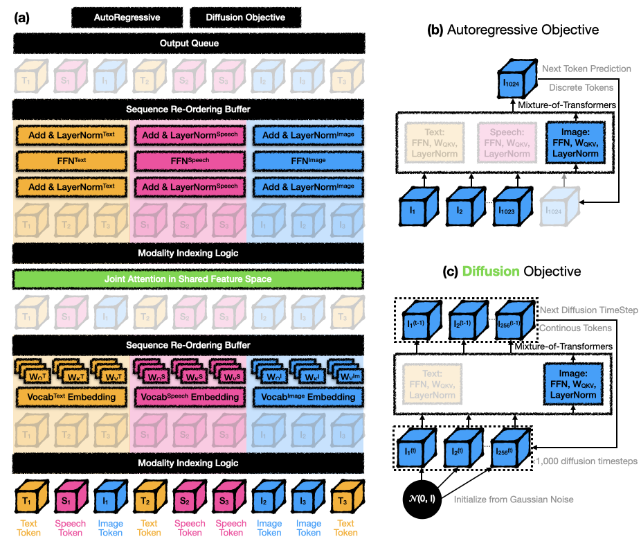

# Mixture-of-Transformers (MoT)
[](https://github.com/facebookresearch/Mixture-of-Transformers/blob/main/LICENSE)
[](https://arxiv.org/abs/2411.04996)
[](https://x.com/liang_weixin/status/1854982365317415222)

💬 This playbook presents a step-by-step tutorial on how to implement the **Mixture-of-Transformer (MoT)** architecture on top of your own transformer model to enable native multimodal generation. It also contains a basic implementation.
> **Mixture-of-Transformers: A Sparse and Scalable Architecture for Multi-Modal Foundation Models**. TMLR (March 2025).\
> Weixin Liang, Lili Yu, Liang Luo, Srinivasan Iyer, Ning Dong, Chunting Zhou, Gargi Ghosh, Mike Lewis, Wen-tau Yih, Luke Zettlemoyer, Xi Victoria Lin\
> Paper: https://arxiv.org/abs/2411.04996



## Key Results
**Mixture-of-Transformers (MoT)** adopts **modality-aware sparsity** in every non-embedding transformer layer (e.g., feed-forward networks, attention matrices, and layer normalization).
- ✅ **Chameleon setting (text + image generation):**
  MoT (7B) matches dense baseline quality using just **55.8% of the FLOPs**.

- ✅ **Chameleon setting (text + image + speech generation):**
  MoT (443M) achieves dense-level speech quality with only **37.2% of the FLOPs**.

- ✅ **Transfusion setting (text autoregressive + image diffusion generation):**
  MoT (7B) matches dense model quality using **one-third of the FLOPs**.

- ✅ **System profiling:**
  MoT (Chameleon setting, 443M) achieves:
  - Dense-level image quality in **47%** of the wall-clock time.
  - Dense-level text quality in **75.6%** of the wall-clock time.
  **(Measured on AWS `p4de.24xlarge` instances with NVIDIA A100 GPUs.)**

💬 Modality-aware sparsity in MoT offers an effective path to native generation of a growing number of modalities, from text and images to speech and beyond.

---

## Tutorial: Step-by-step implementation of MoT

💬 Let's dive in!

---

### **Prerequisite: Your Own Transformer Model**

To implement MoT, start with a basic transformer model implement. Here’s a simplified example:

```python
class FeedForward(torch.nn.Module):
    ...

class Attention(torch.nn.Module):
    ...

class TransformerBlock(torch.nn.Module):
    def __init__(self, args):
        super().__init__()
        self.attention = Attention(args)
        self.feed_forward = FeedForward(args)

    def forward(self, x, *args):
        x = x + self.attention(x, *args)
        return x + self.feed_forward(x, *args)

class Transformer(torch.nn.Module):
    def __init__(self, args):
        super().__init__()
        self.layers = nn.ModuleList([TransformerBlock(args) for _ in range(args.n_layers)])

    def forward(self, x, *args):
        for layer in self.layers:
            x = layer(x, *args)
        return x

```

---

### **Step 1: Modality-Specific Feed-Forward Networks**

The `ModalityUntiedFeedForward` class enhances the feed-forward network by creating separate experts for each modality, enabling specialized processing for tasks involving multiple modalities, such as text, image, or speech.

#### **Key Features**
1. **Decoupled Parameters**: Each modality has its own feed-forward expert, instantiated using the existing `FeedForward` class for modularity and simplicity.
2. **Modality-Specific Routing**: Tokens are (deterministically) routed to modality-specific expert based on the `modality_masks`.
3. **Modality-Specific normalization**: Each modality expert applies its own normalization layer to ensure tailored processing.

💬 Congrats! you have done more than half (67%) of the job -- because `Feedforward` typically takes 67% of the non-embedding parameters of Transformer!


#### **Code**

```python
class ModalityUntiedFeedForward(torch.nn.Module):
    def __init__(self, args):
        super().__init__()
        self.n_modalities = args.n_modalities  # Number of modalities, e.g., 2 (text, image) or 3 (text, image, speech)

        # Initialize feed-forward experts for each modality
        self.local_experts = torch.nn.ModuleList([
            FeedForward(
                dim=args.dim,
                hidden_dim=int(args.ffn_exp * args.dim),
                dropout=args.ffn_dropout,
                ...
            ) for _ in range(self.n_modalities)
        ])

        # Initialize modality-specific normalization layers
        self.local_experts_ffn_norm = torch.nn.ModuleList([
            build_norm_fn(args.norm_type, args.dim, args.norm_eps, args.norm_affine)
            for _ in range(self.n_modalities)
        ])

    def forward(self, x, modality_masks):
        expert_outputs = []

        # Process tokens for each modality separately
        for i in range(self.n_modalities):
            expert_input = x[modality_masks[i]]  # Select tokens for this modality
            expert_output = self.local_experts[i](expert_input)  # Feed-forward processing
            expert_output = self.local_experts_ffn_norm[i](expert_output)  # Normalization
            expert_outputs.append(expert_output)

        # Merge modality-specific outputs into a unified tensor
        merged_output = torch.empty_like(x)
        for i in range(self.n_modalities):
            merged_output[modality_masks[i]] = expert_outputs[i]

        return merged_output
```

#### **Example of `modality_masks`**
In the snippet above, we use `modality_masks`, a list of binary masks to identify which tokens belong to each modality.
  ```
  [[True, False, True, False],  # Text
   [False, True, False, False], # Image
   [False, False, False, True]] # Speech
  ```
Tokens are routed to the corresponding modality-specific expert according to the modality mask.


---

### **Step 2: Modality-Specific Attention Class**

The `ModalityUntiedAttention` class extends the standard transformer attention mechanism by introducing modality-specific weight matrices for queries (`wq`), keys (`wk`), values (`wv`), and output projections (`wo`). It also incorporates modality-specific normalization layers to ensure that the model can handle modality-specific representations more effectively.

---

#### **Key Features**
1. **Decoupled Parameters**: Separate parameters (`wq`, `wk`, `wv`, `wo`) for each modality to capture modality-specific relationships.
2. **Modality-Specific Normalization**: Norm layers for each modality applied to intermediate results (`q`, `k`, `v`) and final attention outputs.
3. **Modality-Specific Routing**: Tokens are (deterministically) routed to modality-specific attention experts using `modality_masks`.
4. **Global Attention**: After the QKV projection, global attention is applied over all tokens in the sequence.
---

#### **Pseudo Code**
```python
class ModalityUntiedAttention(torch.nn.Module):
    """
    Modality-specific attention with decoupled query, key, value, and output projections,
    along with modality-specific normalization layers.
    """

    def __init__(
        self,
        dim: int,
        head_dim: int,
        n_heads: int,
        dropout: float,
        norm_eps: float = 1e-5,
        qk_normalization: bool = False,
        n_modalities: int = 2,
    ):
        super().__init__()

        self.n_modalities = n_modalities

        # Initialize modality-specific query, key, value, and output projections
        self.local_experts_wq = self._create_experts(dim, n_heads * head_dim)
        self.local_experts_wk = self._create_experts(dim, n_heads * head_dim)
        self.local_experts_wv = self._create_experts(dim, n_heads * head_dim)
        self.local_experts_wo = self._create_experts(n_heads * head_dim, dim)

        # QK normalization (if enabled)
        self.head_dim = head_dim
        if qk_normalization:
            self.local_experts_q_normalization = self._create_norms(head_dim, self.n_modalities, eps=norm_eps)
            self.local_experts_k_normalization = self._create_norms(head_dim, self.n_modalities, eps=norm_eps)

        # Final output normalization for each modality
        self.local_experts_attention_norm = self._create_norms(dim, self.n_modalities)

        # Inner attention mechanism
        self.attention_comp = torch.nn.MultiheadAttention(
            head_dim=head_dim,
            n_heads=n_heads,
            dropout=dropout,
        )

    def _create_experts(self, input_dim, output_dim):
        """
        Helper to create modality-specific linear projections.
        """
        return torch.nn.ModuleList(
            [
                torch.nn.Linear(
                    input_dim,
                    output_dim,
                    bias=False,
                    params_dtype=torch.get_default_dtype(),
                )
                for _ in range(self.n_modalities)
            ]
        )

    def _create_norms(self, dim, n_modalities, eps=1e-5):
        """
        Helper to create modality-specific normalization layers.
        """
        return torch.nn.ModuleList(
            [torch.nn.LayerNorm(dim, eps) for _ in range(n_modalities)]
        )

    def forward(
        self,
        x: torch.Tensor,
        attn_mask: torch.Tensor,
        modality_masks: torch.Tensor,
    ):
        # Extract modality-specific tokens
        expert_outputs_xq, expert_outputs_xk, expert_outputs_xv = self._process_qkv(
            x, modality_masks
        )

        #  Merge modality-specific Q, K, V outputs into unified tensors for attention computation
        xq = merge_modalities(expert_outputs_xq, modality_masks)
        xk = merge_modalities(expert_outputs_xk, modality_masks)
        xv = merge_modalities(expert_outputs_xv, modality_masks)

        # Compute attention output
        attn_output, attn_output_weights = self.attention_comp(
            xq, xk, xv, attn_mask=attn_mask
        )

        # Process final output with modality-specific projections and normalization
        attn_output = self._process_final_output(attn_output, modality_masks)

        return attn_output, attn_output_weights

    def _process_qkv(self, x, modality_masks):
        """
        Process query, key, and value projections for each modality.
        """
        expert_outputs_xq, expert_outputs_xk, expert_outputs_xv = [], [], []
        for i in range(self.n_modalities):
            expert_input = x[modality_masks[i]]
            xq = self.local_experts_wq[i](expert_input)
            xk = self.local_experts_wk[i](expert_input)
            xv = self.local_experts_wv[i](expert_input)

            # Apply QK normalization if enabled
            if hasattr(self, "local_experts_q_normalization"):
                xq = self.local_experts_q_normalization[i](xq) # see src/simple_ModalityUntiedAttention.py
                xk = self.local_experts_k_normalization[i](xk) # see src/simple_ModalityUntiedAttention.py
            expert_outputs_xq.append(xq)
            expert_outputs_xk.append(xk)
            expert_outputs_xv.append(xv)

        return expert_outputs_xq, expert_outputs_xk, expert_outputs_xv

    def _merge_modalities(self, expert_outputs, modality_masks):
        """
        Merge modality-specific outputs into a unified tensor.
        """
        merged = torch.empty_like(expert_outputs[0])
        for i, expert_output in enumerate(expert_outputs):
            merged[modality_masks[i]] = expert_output
        return merged

    def _process_final_output(self, output, modality_masks):
        """
        Process final attention output with modality-specific `wo` projections and normalization.
        """
        expert_outputs = []
        for i in range(self.n_modalities):
            expert_input = output[modality_masks[i]]
            expert_output = self.local_experts_wo[i](expert_input)
            expert_output = self.local_experts_attention_norm[i](expert_output)
            expert_outputs.append(expert_output)
        return self._merge_modalities(expert_outputs, modality_masks)
```
💬 To summarize the code flow:

1. **Initialization**:
   - Create modality-specific projections (`wq`, `wk`, `wv`, `wo`) and norm layers for each modality.
2. **QKV Projection and Normalization**:
   - Route tokens to modality-specific `wq`, `wk`, `wv` and QK-norm experts using `modality_masks`.
   - Re-pack the resulting queries, keys, and values into their original sequence order.
3. **Attention Computation**:
   - Compute global self-attention.
4. **Output Projection and Normalization**:
   - Pass self-attention outputs through modality-specific `wo` and output norms.
   - Re-pack the resulting outputs into their original sequence order to form the final module output.

Please refer to [`src/simple_ModalityUntiedAttention.py`](src/simple_ModalityUntiedAttention.py) for the complete implementation.

---

### **Step 3: Handling Norms**
💬 Here are some special tips on how to handle implementation of the norms.

If your `TransformerBlock` already handles normalization within the attention and feed-forward classes, you're all set:

```python
class TransformerBlock(torch.nn.Module):
    def forward(self, x):
        h = x + self.attention(x)
        out = h + self.feed_forward(h)
        return out
```

If not, we recommend moving normalization into the respective attention and feed-forward classes, as shown in the implementations above.

---

### **Bringing It All Together**

By combining `ModalityUntiedFeedForward` and `ModalityUntiedAttention`, MoT introduces modality-specific specialization where each modality adopts a completely separate set of transformer parameters. Interaction across modalities is enabled via global self-attention at each layer.

**These modular extensions integrate seamlessly into existing transformer architectures**, offering efficient and scalable solutions for multi-modal tasks.

💬 Excited to try it out? We're looking forward to hearing your experience applying MoT to your own multimodal LLM project! 🚀


## Citation

If you use this codebase, or otherwise find our work valuable, please cite:
```
@article{
  liang2025mixtureoftransformers,
  title={Mixture-of-Transformers: A Sparse and Scalable Architecture for Multi-Modal Foundation Models},
  author={Weixin Liang and LILI YU and Liang Luo and Srini Iyer and Ning Dong and Chunting Zhou and Gargi Ghosh and Mike Lewis and Wen-tau Yih and Luke Zettlemoyer and Xi Victoria Lin},
  journal={Transactions on Machine Learning Research},
  issn={2835-8856},
  year={2025},
  url={https://openreview.net/forum?id=Nu6N69i8SB},
  note={}
}
```

## License
This repository is licensed under BSD-3-Clause license. Refer to the LICENSE file in the root directory.
